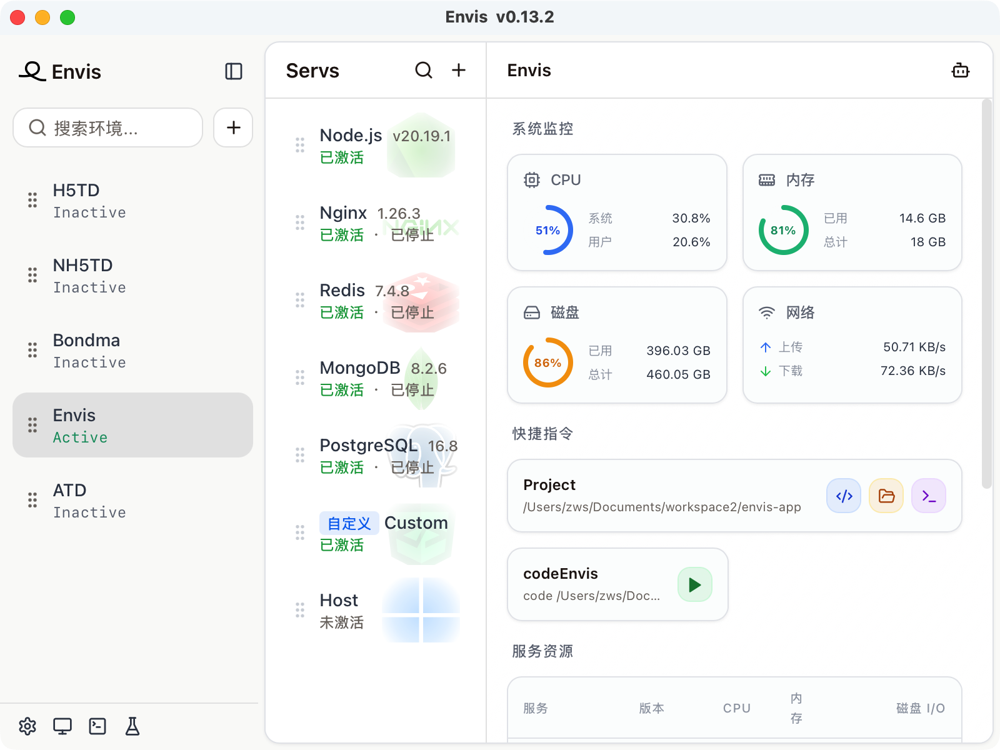
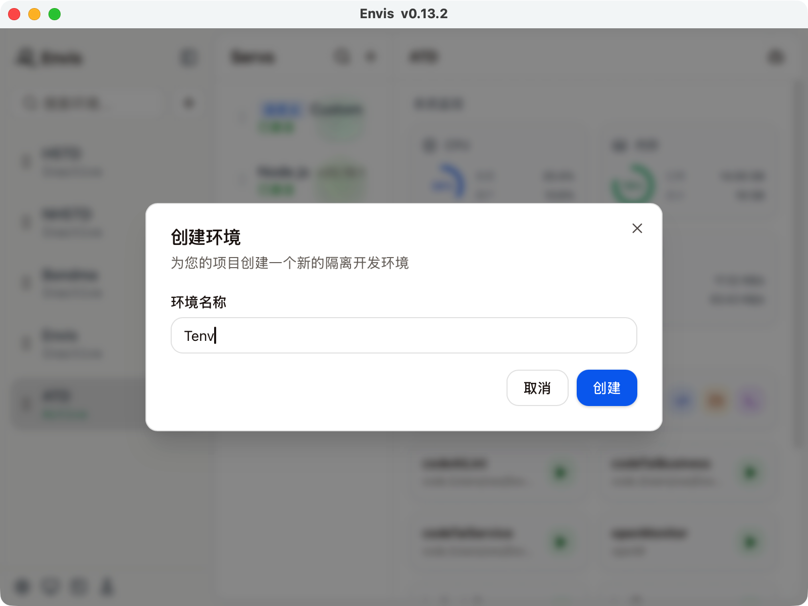
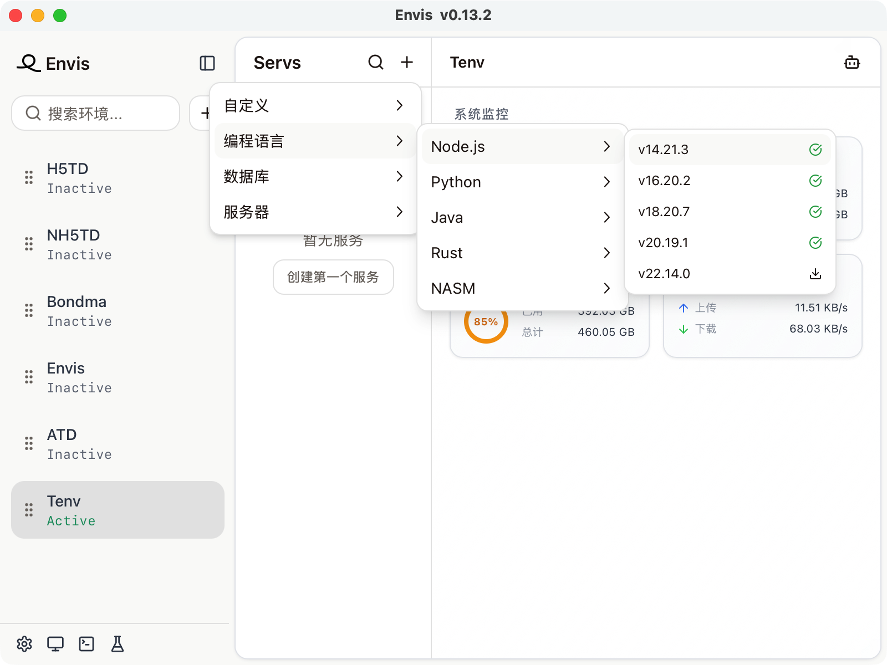
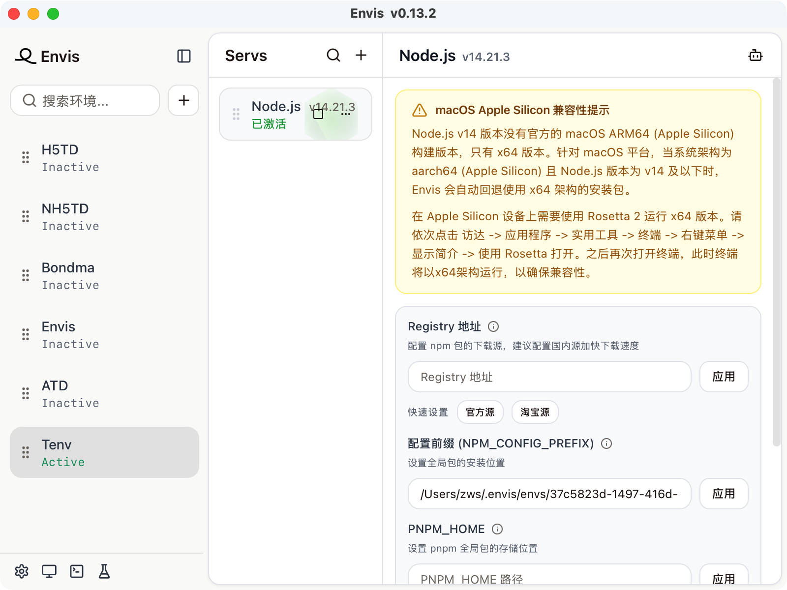

Envis是一款开源免费的开发环境管理器，能够对多种开发环境进行统一管理，支持Java，Nodejs，MySQL等开发工具的下载，配置，版本切换等，解决安装配置开发环境困难，在不同项目间切换不同开发环境不方便的痛点。

Envis主要解决两个痛点：

* 给项目安装若干开发环境的痛点
* 不同项目切换时需要切换若干开发环境的痛点

这个 Envis 是怎么用的呢？这里会有“环境”的概念，一个环境里会有若干“服务”，例如NodeJS服务，Java服务，在切换开发环境的时候，我们只需要“激活”指定的环境，就可以自动激活所有的服务。相对于手动执行 nvm，uv 等版本管理命令，在 Envis 这里只需要点击一个按钮即可。

那 Envis 是如何实现这一点的呢？其本质实际上是直接修改终端配置文件，Envis在终端配置文件中维护一个块，当激活环境的时候，在这个块里添加当前服务下所有环境的路径，环境变量等，以达到在终端命令行中使用相应服务的目的。

除此之外，Envis 有自己的软件源，可以一键安装想要的服务。众所周知，国内有的某种网络问题，有些软件下不下来，或者一些过旧的软件例如 NodeJS14，Python2.7 等其官网已经不提供下载了，安装这些服务软件比较麻烦。Envis通过Github Action自动构建软件源，并上传到Github Release中，这样Envis就可以从Github Release中获取指定版本的服务软件，由于Envis的使用场景是开发环境，因此在安全性上还是可以接受。

Envis 可以管理NodeJS，Java，Python，Rust，Nginx，MariaDB，MySQL，PostgreSQL等主流服务。目前 Envis 已经实现了自举，即用 Envis 管理开发 Envis 的开发环境。

Envis 的使用方法：

首先需要新建一个环境，不同的项目可以有自己单独的环境，如果环境相同的话那么多个项目可以用同一个环境：

创建环境之后，点击激活按钮，这个环境就算激活了，但是此时还没有任何服务，这个时候就需要新建服务，例如创建一个NodeJS14服务：

创建时若未下载，首先会自动下载NodeJS，安装完毕后会自动激活该服务，也有按钮单独控制该服务是否激活：

进入服务面板后，可以看到这里有非常多的配置项，我用的是M芯片的Mac，安装NodeJS14后还会有一个警告的tips，说明Node.js v14 版本没有官方的 macOS ARM64 (Apple Silicon) 构建版本，建议使用 Rosetta 2 运行 x64 版本。另外例如NodeJS的仓库地址，npm prefix等，都可以可视化配置，并有预设按钮一键切换国内源。
